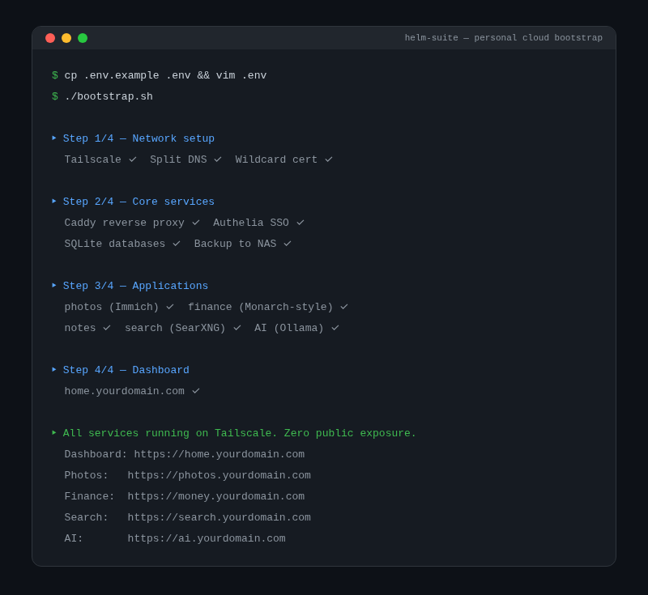

<div align="center">
  
  <h1>Helm Suite</h1>
  <p><strong>Personal cloud infrastructure suite — bootstrap your own private homelab with a NAS, Tailscale, and security best practices</strong></p>
  <p>
    <a href="https://tannner.com">tannner.com</a> ·
    <a href="https://github.com/tannernicol/helm-suite">GitHub</a>
  </p>
</div>

---

<p align="center">
  
</p>

## What it does

[Helm](https://thehelm.com) (RIP) was ahead of its time. To complete the healing process for this startup closing, I built out the whole vision using a NAS, Tailscale, and security best practices. With the assist of agentic coding, building your own personal, private, fast internet is completely feasible.

This repo walks you through setting up and bootstrapping your own homelab — from zero to a personal dashboard with apps you own, running on hardware you control.

## What you'll end up with

- **Reverse proxy** (Caddy) with automatic HTTPS on your own domain
- **Photo library** (Immich) — Google Photos replacement, fully private
- **Finance dashboard** — track accounts, spending, net worth
- **AI stack** (Ollama) — local LLMs, no cloud dependency
- **Secure networking** (Tailscale) — access everything from anywhere, zero public exposure
- **Auth gateway** (Authelia) — SSO for all your services
- **Automated backups** to NAS with versioned snapshots

## Quick start

```bash
git clone https://github.com/tannernicol/helm-suite.git
cd helm-suite

# 1. Configure your environment
cp .env.example .env && vim .env

# 2. Bootstrap everything
./bootstrap.sh
```

```
$ ./bootstrap.sh
→ caddy ✓  immich ✓  monarch ✓  ollama ✓
→ All services on Tailscale. Zero public exposure.
```

## Prerequisites

- A NAS or always-on machine (Synology, Unraid, old PC, etc.)
- [Tailscale](https://tailscale.com) account (free tier works)
- A domain name (optional but recommended)

## Architecture

```
                    Internet
                       |
                   Tailscale
                       |
              +--------+--------+
              |   Caddy (TLS)   |
              +--------+--------+
                       |
         +------+------+------+------+
         |      |      |      |      |
       Immich  Money  Ollama  Your
       Photos  App    AI      Apps
         |      |      |      |
         +------+------+------+------+
                       |
                   SQLite / NAS
```

## Stack

- **Caddy** — reverse proxy + automatic TLS
- **Tailscale** — zero-config VPN mesh
- **Authelia** — SSO + 2FA
- **Python / FastAPI / SQLite** — for custom apps
- **Systemd** — service management
- **NAS** — storage + backups

## Author

**Tanner Nicol** — [tannner.com](https://tannner.com) · [GitHub](https://github.com/tannernicol) · [LinkedIn](https://linkedin.com/in/tanner-nicol-60b21126)
