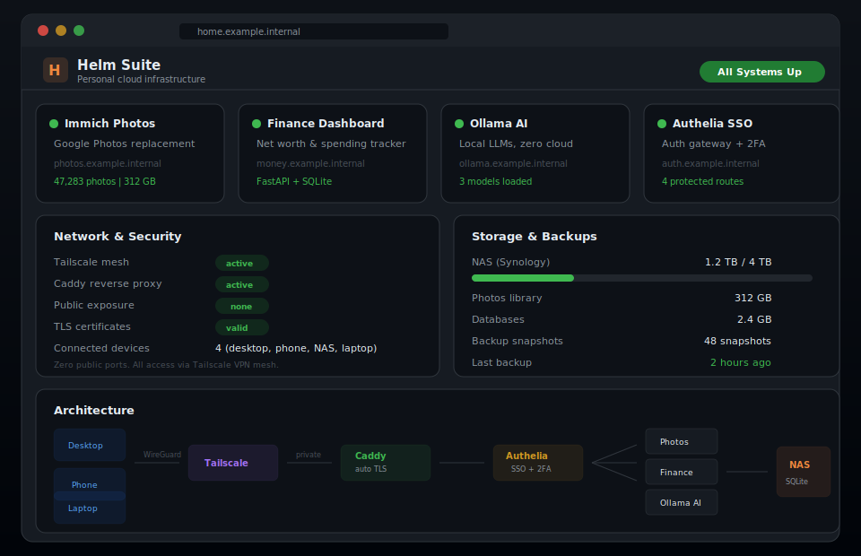

<div align="center">
  
  <h1>Helm Suite</h1>
  <p><strong>Personal cloud infrastructure suite — bootstrap your own private homelab with a NAS, Tailscale, and security best practices</strong></p>
  <p>
    <a href="https://tannner.com">tannner.com</a> ·
    <a href="https://github.com/tannernicol/helm-suite">GitHub</a>
  </p>

[](https://github.com/tannernicol/helm-suite/actions/workflows/ci.yml)
[](https://www.python.org/downloads/)
[](LICENSE)
</div>

---

<p align="center">
  
</p>

## The Problem

Your photos live on Google's servers. Your finances flow through Mint's APIs. Your AI assistant phones home to OpenAI. You own none of it, control none of it, and when any of these companies pivot, get acquired, or shut down — you start over.

## The Solution

[Helm](https://thehelm.com) (RIP) was ahead of its time — a personal server that gave you ownership of your digital life. When the startup closed, I built the whole vision myself: a NAS, Tailscale, and security best practices. Photos, finance, AI, auth — all running on hardware I control, accessible from anywhere, exposed to nobody.

**This repo is the complete blueprint. From zero to a private personal cloud in one bootstrap.**

## What you'll end up with

- **Reverse proxy** (Caddy) with automatic HTTPS on your own domain
- **Photo library** (Immich) — Google Photos replacement, fully private
- **Finance dashboard** — track accounts, spending, net worth
- **AI stack** (Ollama) — local LLMs, no cloud dependency
- **Secure networking** (Tailscale) — access everything from anywhere, zero public exposure
- **Auth gateway** (Authelia) — SSO for all your services
- **Automated backups** to NAS with versioned snapshots

## Quick start

```bash
git clone https://github.com/tannernicol/helm-suite.git
cd helm-suite

# 1. Configure your environment
cp .env.example .env && vim .env

# 2. Bootstrap everything
./bootstrap.sh
```

```
$ ./bootstrap.sh
Helm Suite Bootstrap
========================================

Checking prerequisites
  docker ✓
  caddy ✓
  tailscale ✓
  ollama ✓
  python3 ✓

Bootstrap complete.
```

## Prerequisites

- A NAS or always-on machine (Synology, Unraid, old PC, etc.)
- [Tailscale](https://tailscale.com) account (free tier works)
- A domain name (optional but recommended)

## Architecture

```
                    Internet
                       |
                   Tailscale
                       |
              +--------+--------+
              |   Caddy (TLS)   |
              +--------+--------+
                       |
         +------+------+------+------+
         |      |      |      |      |
       Immich  Money  Ollama  Your
       Photos  App    AI      Apps
         |      |      |      |
         +------+------+------+------+
                       |
                   SQLite / NAS
```

## Stack

- **Caddy** — reverse proxy + automatic TLS
- **Tailscale** — zero-config VPN mesh
- **Authelia** — SSO + 2FA
- **Python / FastAPI / SQLite** — for custom apps
- **Systemd** — service management
- **NAS** — storage + backups

## Author

**Tanner Nicol** — [tannner.com](https://tannner.com) · [GitHub](https://github.com/tannernicol) · [LinkedIn](https://linkedin.com/in/tanner-nicol-60b21126)
