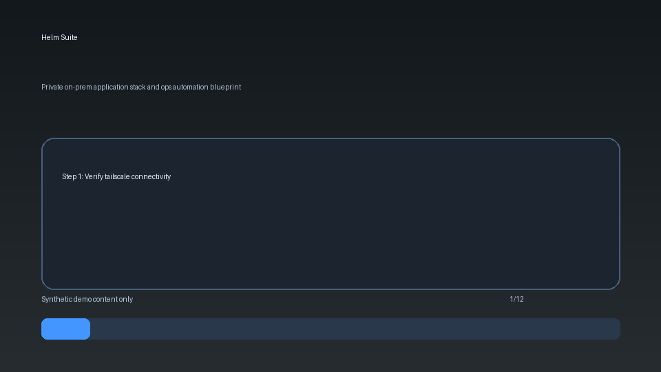

<div align="center">
  
  <h1>Helm Suite</h1>
  <p><strong>Replace 5 SaaS products with one Linux box and a Tailscale account.</strong></p>
  <p>
    <a href="https://tannner.com">tannner.com</a> ·
    <a href="https://github.com/tannernicol/helm-suite">GitHub</a>
  </p>

[](https://github.com/tannernicol/helm-suite/actions/workflows/ci.yml)
</div>

---

<p align="center">
  
</p>

In 2019, [The Helm](https://www.theverge.com/2019/11/21/20975649/time-best-inventions-2019-list) was named a TIME Best Invention — a personal server that kept your data in your home. They ran out of funding. The mission didn't.

Helm Suite is a complete blueprint for replacing cloud services with self-hosted infrastructure on hardware you control. Everything runs behind Tailscale with **zero public exposure** — your services are reachable from your devices, invisible to the rest of the internet.

| You're paying for | Helm Suite replaces it with | Cost |
|---|---|---|
| Google Photos ($30/yr) | **Immich** — face recognition, maps, ML search | Free |
| GitHub Pro ($48/yr) | **Gitea** — unlimited private repos, CI runners | Free |
| ChatGPT Plus ($240/yr) | **Ollama** — run LLMs on your GPU, no data leaves | Free |
| Google Search (your data) | **SearxNG** — private metasearch, no tracking | Free |
| 1Password/SSO ($36/yr) | **Authelia** — single sign-on for all services | Free |

**Total saved: ~$350/yr** (plus you own your data)

## Quick Start

```bash
git clone https://github.com/tannernicol/helm-suite.git
cd helm-suite

# 1. Configure
cp .env.example .env && vim .env

# 2. Bootstrap
./bootstrap.sh
```

```
$ ./bootstrap.sh
→ caddy ✓  immich ✓  ollama ✓  authelia ✓
→ All services on Tailscale. Zero public exposure.
```

> **Note:** This repo provides bootstrap tooling, example configs, and architecture documentation. Production configs (credentials, domain-specific rules, service tuning) are kept private for operational security. The templates here are ready to customize for your own setup.

## Architecture

```
                     Tailscale VPN (100.x.x.x)
                              |
            +------- your.domain.com -------+
            |                               |
        +---+---+                      +----+----+
        | Caddy |--- TLS + Auth ------>| Authelia|
        +---+---+                      +---------+
            |
    +-------+-------+-------+-------+-------+
    |       |       |       |       |       |
 Ollama  Immich  Gitea  SearxNG  Grafana  Apps
 :11434  :2283   :3030  :8095    :3100    :...
    |       |
  [GPU]   [GPU]
```

All services bind to `127.0.0.1` or your Tailscale IP. Caddy handles TLS termination and forwards auth to Authelia. Nothing is reachable from the public internet.

## What's Included

```
helm-suite/
  .env.example                  # All configurable variables
  bootstrap.sh                  # One-command setup
  config/
    docker-compose.yml          # Multi-service stack
    Caddyfile.example           # Reverse proxy template
    helm-service@.service       # Systemd template for native services
    example.yaml                # Service configuration
  scripts/
    healthcheck.sh              # Service health monitoring
    demo.py                     # Demo harness
  docs/
    architecture.md             # System design
    setup.md                    # Detailed setup guide
    examples.md                 # Usage examples
    faq.md                      # Common questions
```

## What Makes It Different

Most self-hosting guides show you how to run one container. Helm Suite gives you the whole stack:

- **Zero public exposure** — Everything binds to your Tailscale IP. Nothing on the public internet, ever.
- **Single config** — One `.env` file drives Caddy routes, Docker Compose, and systemd services.
- **GPU-first** — NVIDIA runtime for Ollama and Immich ML (face recognition, CLIP search).
- **Security audit built in** — `healthcheck.sh` checks service status across the stack.

## Prerequisites

- Linux server (Fedora, Ubuntu, or similar)
- [Tailscale](https://tailscale.com) account (free tier works)
- Docker + Docker Compose
- A domain name (optional but recommended)
- NVIDIA GPU (optional, for Ollama/Immich ML)

## Author

**Tanner Nicol** — [tannner.com](https://tannner.com) · [GitHub](https://github.com/tannernicol)

## License

MIT — see [LICENSE](LICENSE).
